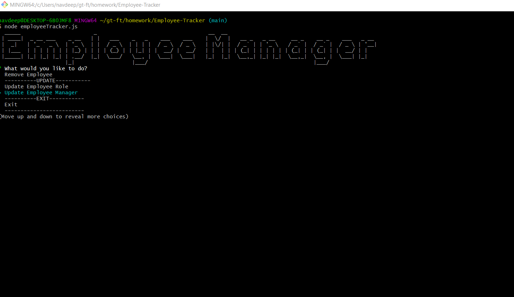

# Employee-Tracker

## The Repository

The link to the website repository: [Website Repo link](https://github.com/NavdeepDP/Employee-Tracker)

## Development Environment
- Code is developed in VS code Studio using node, inquirer, and MySQL.

## Functionality

Command line interface to manage company's employees. The application contains three tables: employee, role and department. This command-line application allows
the user to view, add, modify and delete information. User can:

- View departments, roles, employees
- View the total utilized budget of all departments -- ie the combined salaries of all employees in that department
- View employees by manager
- Add departments, roles, employees
- Update employee roles
- Update employee managers
- Delete employees

## Installation

- Code is developed using VS Code studio.
- Code is available at the GITHub repository link: [Website Repo link](https://github.com/NavdeepDP/Employee-Tracker))
- Get the code code in your local machine by using the clone option in the repository link.
- Click "Code" and copy the Clone with SSH key link.
- In Git bash, go to the appropriate directory and get the code using "git clone" command.
- In Vs Code terminal , go to the project directory.
- Run "npm install" - it will install all the packages(inquirer for this application) required for the application.  

## References

- [w3schools.com](https://www.w3schools.com/)
- [MDN web docs](https://developer.mozilla.org/en-US/docs/Web/JavaScript)
- [Inquirer](https://www.npmjs.com/package/inquirer#methods)
- [Nodejs Links](https://nodejs.org/dist/latest-v12.x/docs/api/index.html)
- [Express](https://expressjs.com/en/5x/api.html)
- [MySql](https://www.w3schools.com/sql/default.asp)